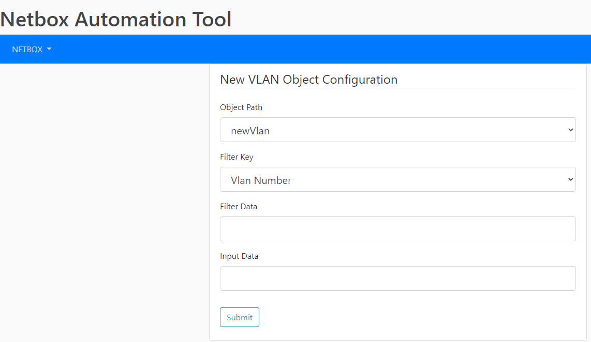

# Netbox Tool Beta

This script trys to write netbox CRUD within class and be familiar with API

### Status
Currently it only can check if certain vlan does exist, if not, create a new one.
It has a basic interface to collect input from user using Flask.
Later on, the "Meraki-Deployments-App" interface may be a good user friendly interface

### How to access:

1. Run GUI.py
2. Open website using http://127.0.0.1:500
3. Select/enter required information and click "Submit" button

### Be aware
* This is for quick testing purpose, some security information is writenn in clear text,\
  environment is on local pc, so it is not a concern at the moment.
